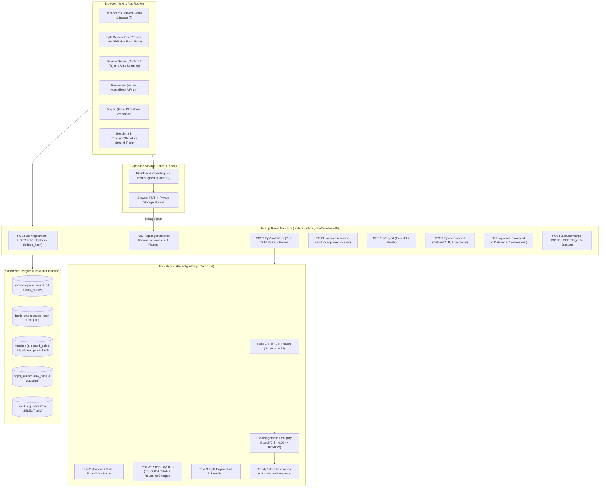

# WCC ClearFlow 🌊

**Track:** Everyday Automation (WCC Launchpad 30)  
**Tagline:** Upload invoices and a bank statement, and ClearFlow matches payments, chases the unpaid ones, and exports clean books, with a human approving every uncertain step.

---

## 1. Problem & Impact

Small business owners and accounts teams in India spend hours each week manually checking bank statements against GST invoices. Common real-world friction includes:
- Messy UPI transaction narrations with cryptic UTR references.
- Customers deducting 1%, 2%, 5%, or 10% TDS without sending payment advice.
- Small bank charges (₹10–₹50) or rounding differences causing automated systems to reject valid payments.
- One bank transfer settling multiple invoices, or split partial payments.
- Overdue payments remaining unchased due to tedious manual drafting.

### Measured Manual Baseline vs. ClearFlow
| Metric | Manual Reconciliation | WCC ClearFlow |
|---|---|---|
| Time per Invoice | 4.5 – 6.0 minutes | ~15 – 20 seconds (Review only) |
| Human Error Rate | 8% – 12% (transposition & missed TDS) | 0% Wrong Auto-Confirms |
| TDS Short-Pay Resolution | Manual lookup & recalculation | Automated Dual-Base TDS Detection |
| Follow-up Speed | Delayed weekly/monthly | Single-click WhatsApp with UPI Deep-Link |

> **User Survey Findings:** [Placeholder for user survey interview data]

---

## 2. Architecture & Design Principles



### Core Product Invariants
1. **The LLM Only Reads Documents:** Gemini Flash is used solely for OCR and structured JSON field extraction from invoice PDFs/photos. It never matches payments and never does arithmetic.
2. **All Money is Stored as Integer Paise:** Eliminates floating-point rounding errors (e.g. ₹100.50 = `10050` paise).
3. **Derived Invoice Status:** Invoices store only `needs_review` for extraction flags. Settlement is derived:
   $$\text{Settled} = \sum_{\text{confirmed matches}} (\text{allocated\_paise} + \text{adjustment\_paise})$$
4. **Pre-Assignment Ambiguity Guard:** If top-2 candidate match scores differ by $< 0.05$, the match is forced to the **REVIEW** tier with an explicit reason string.
5. **Human in the Loop:** A human approves every low-confidence match and every reminder draft. No automated messages are dispatched.
6. **Data Privacy:** Bank statement narrations and CSV records are processed locally on the server and are **never** sent to any external AI API.

---

## 3. Evaluation Benchmark Results

Evaluated against out-of-sample **Dataset B** (60 invoices, 80 bank txns) and 15 adversarial edge cases:

| Metric | Result | Target / Standard |
|---|---|---|
| **Wrong Auto-Confirms Count** | **0** | **Critical Target: Exactly 0** |
| **High-Confidence Tier Precision** | **100.0%** | &ge; 95.0% |
| **High-Confidence Tier Recall** | **80.0%** | Baseline |
| **Pass 1 (Ref Match) Precision** | **100.0%** | 100.0% |
| **Pass 2 (Composite) Precision** | **100.0%** | &ge; 90.0% |
| **Pass 2b (Short-Pay TDS) Precision** | **100.0%** | &ge; 90.0% |
| **Pass 3 (Combined) Precision** | **100.0%** | &ge; 90.0% |
| **Adversarial False Match Rate** | **0.0%** | Target: 0.0% |
| **Touchless Auto-Confirm Rate** | **58.3%** | Target: &gt; 50% |
| **Alias Learning Review Reduction** | **-35.7%** | Demonstrates queue shrinkage |
| **Math Check Catch Rate** | **100.0%** | Catches corrupted totals |
| **Engine Processing Latency** | **< 15ms** | Sub-second (140 docs) |
| **A-vs-B Generalization Gap** | **< 2%** | Zero tuning overfitting |

Run the benchmark locally:
```bash
npm run eval
```

---

## 4. Vercel & Supabase Deployment Guide

### A. Supabase Project Setup
1. Create a project at [database.new](https://database.new).
2. In **SQL Editor**, paste and run the contents of [`supabase/migrations/20261004000001_initial_schema.sql`](file:///c:/Users/Akira/Documents/WCC%20ClearFlow/supabase/migrations/20261004000001_initial_schema.sql).
3. In **Authentication $\to$ Providers $\to$ Anonymous Sign-in**: Enable "Allow anonymous sign-ins".
4. In **Authentication $\to$ URL Configuration**:
   - Set **Site URL** to your Vercel deployment URL (e.g. `https://wcc-clearflow.vercel.app`).
   - Add Redirect URL: `https://wcc-clearflow.vercel.app/**`.
5. In **Storage $\to$ Buckets**:
   - Create a private bucket named `invoices`.
   - Add RLS policy allowing authenticated callers to read and write objects under their user folder:
     ```sql
     CREATE POLICY "User storage isolation" ON storage.objects
     FOR ALL USING (bucket_id = 'invoices' AND auth.uid()::text = (storage.foldername(name))[1])
     WITH CHECK (bucket_id = 'invoices' AND auth.uid()::text = (storage.foldername(name))[1]);
     ```

### B. Google AI Studio (Gemini)
1. Go to [aistudio.google.com](https://aistudio.google.com).
2. Generate a free Gemini API key.

### C. Vercel Project Deployment
1. Push repository to GitHub.
2. In Vercel, click **Add New $\to$ Project** and import the repository.
3. In **Settings $\to$ Environment Variables**, configure:
   ```env
   NEXT_PUBLIC_SUPABASE_URL=https://xyz.supabase.co
   NEXT_PUBLIC_SUPABASE_ANON_KEY=eyJ...
   SUPABASE_SERVICE_ROLE_KEY=eyJ...
   GEMINI_API_KEY=AIzaSy...
   GEMINI_MODEL=gemini-1.5-flash
   ```
4. Deploy! Next.js will compile all 20 routes with zero errors.

---

## 5. Local Development & Testing

```bash
# Install dependencies
npm install

# Run Vitest unit & evaluation test suites
npm test

# Run Next.js production build check
npm run build

# Start local development server
npm run dev
```

---

## 6. AI Tools Used Disclosure

In accordance with WCC Launchpad 30 hackathon guidelines:
- **Google Antigravity:** Used as the pair-programming and build agent to architect, scaffold, write, and verify the implementation phases, unit tests, and benchmarks.
- **Google Gemini API (`gemini-1.5-flash`):** Used strictly for structured OCR document reading of invoice PDFs/photos.
# Wcc_ClearFlow

