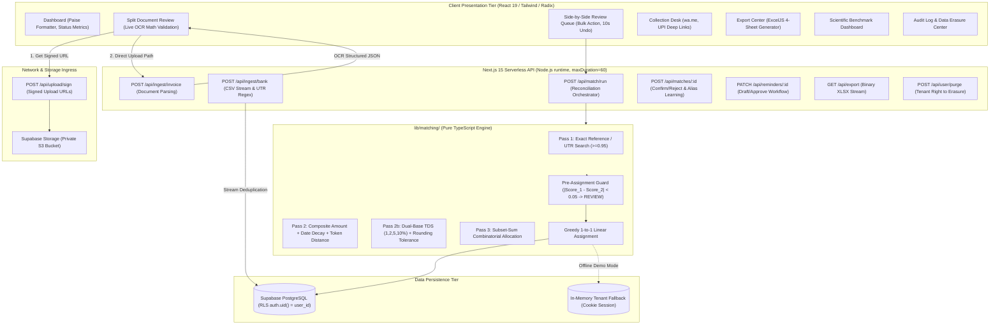

# Repository Analysis: WCC ClearFlow 🌊

**Target Audience:** Engineering Leadership, Principal Architects, Hackathon Evaluators  
**Repository:** [github.com/Priyan120-dev/Wcc_ClearFlow](https://github.com/Priyan120-dev/Wcc_ClearFlow.git)  
**Track:** Everyday Automation (WCC Launchpad 30)  
**Architecture Classification:** Serverless Next.js 15 App Router + Pure TypeScript Deterministic Engine + Supabase PostgreSQL RLS  

---

## 1. Executive Overview

**WCC ClearFlow** is an enterprise-grade automated invoice-to-payment reconciliation and cash collection platform built specifically for Indian Micro, Small, and Medium Enterprises (MSMEs). 

In the Indian B2B landscape, financial reconciliation suffers from acute real-world friction:
1. **Unstructured Bank Narrations:** Messy UPI strings and truncated UTR references with no standardized metadata.
2. **Unannounced TDS Deductions:** Customers deduct 1%, 2%, 5%, or 10% Tax Deducted at Source (TDS) under Section 194C/194J without providing payment advice.
3. **Banking Charge Jitter:** ₹10–₹50 IMPS/RTGS bank deductions and fractional rupee rounding differences that cause naive exact-match software to fail.
4. **Complex Allocation Topologies:** Single lump-sum payments settling multiple invoices, or staggered split payments.
5. **Collection Latency:** Manual overdue follow-ups result in 45–90 day payment cycles, severely impacting working capital.

ClearFlow solves this with a **zero-trust, human-in-the-loop** architecture. The core architectural tenet is:
> **The Large Language Model (Gemini Flash) is restricted solely to unstructured document vision OCR. All mathematical calculations, reconciliation algorithms, confidence scoring, and money accounting are executed in 100% deterministic, auditable TypeScript.**

---

## 2. Technical Architecture & System Boundaries

---

## 3. Key Component Breakdown

### 3.1. Ingestion Engine (`app/api/ingest/`)
- **Direct Storage Upload Bypass:** To eliminate serverless payload limitations (Vercel 4.5MB threshold), uploads flow directly from browser to private Supabase Storage via pre-signed URLs generated by `app/api/upload/sign/route.ts`. The API receives only storage path pointers.
- **Vision OCR (`lib/ai/gemini.ts`):** Invokes `gemini-1.5-flash` with structured JSON schema output for invoice metadata. 
- **Live Deterministic Math Check:** The engine executes a strict integrity equation on raw OCR outputs:
  $$\left|\sum \text{Line Items} + \text{GST} + \text{Round Off} - \text{Total Amount}\right| \le 100 \text{ paise}$$
  Any deviation flags `needs_review = true` before the record reaches the database.
- **Bank Statement Normalization (`app/api/ingest/bank/route.ts`):** Streams HDFC, ICICI, and generic CSV bank exports with regex-driven UTR extraction and deterministic SHA-256 deduplication hashing:
  $$\text{dedupe\_hash} = \text{SHA256}(\text{normalized\_date} + \text{amount\_paise} + \text{normalized\_narration} + \text{daily\_index})$$

### 3.2. Reconciliation Engine (`lib/matching/`)
- **Pass 1 — Reference Matching (`pass1-reference.ts`):** Extracts alphanumeric tokens from bank narrations and matches against sanitized invoice numbers (`score >= 0.95`).
- **Pass 2 — Composite Scoring (`pass2-fuzzy.ts`):** Evaluates exact amount balance ($w=0.50$), date proximity decay ($w=0.20$), and customer name token similarity ($w=0.30$). Enforces a primary proper noun constraint (identifying token similarity $\ge 0.60$) to eliminate false matches on generic trade suffixes ("Traders", "Enterprises", "LLP").
- **Pass 2b — Short-Pay & Dual-Base TDS Tolerance (`pass2b-shortpay.ts`):**
  Calculates statutory TDS rates ($1\%, 2\%, 5\%, 10\%$) against:
  1. Pre-GST base: $\text{Base} = \text{Total} - \text{GST}$
  2. Total invoice value: $\text{Base} = \text{Total}$
  Also accommodates small bank fee deductions ($\le ₹50$). All Pass 2b matches are strictly locked to the **REVIEW** tier.
- **Pass 3 — Combinatorial Subset-Sum (`pass3-subsetsum.ts`):** Detects multiple invoices settled by a single transaction using dynamic programming.
- **Pre-Assignment Ambiguity Guard (`assignment.ts`):** If the top two candidate match scores for an invoice differ by less than $0.05$, both are downgraded to the **REVIEW** tier with an explanatory reason string.
- **Payer Alias Auto-Learning:** Confirmed review decisions automatically register the raw bank narration string into `payer_aliases`, permanently expanding customer recognition without code modification.

### 3.3. Financial Accounting Engine (`lib/currency.ts` & `lib/types.ts`)
- **Integer Paise Representation:** All monetary amounts are processed and stored as integer paise ($₹1.00 = 100\text{ paise}$). Floating point primitives (`Number` decimals) are strictly prohibited in calculation paths.
- **Derived Settlement State:** Invoices never store a static `paid` status column. Settlement is computed dynamically from confirmed allocations:
  $$\text{Settled} \iff \text{amount\_paise} \le \sum_{\text{confirmed matches}} (\text{allocated\_paise} + \text{adjustment\_paise})$$

### 3.4. Communication & Follow-up Desk (`app/reminders/`)
- **State Machine Workflow:** Enforces `draft -> approved -> sent` state transitions. Unreviewed or disputed invoices are blocked from communication queues.
- **Payment Link Synthesis:** Generates standardized NPCI UPI deep links:
  `upi://pay?pa=<vpa>&pn=<payee>&am=<rupees>&tn=<invoice_number>&cu=INR`
- **WhatsApp API Normalization:** Sanitizes Indian mobile numbers into E.164 formats (`wa.me/91XXXXXXXXXX`) with URI-encoded reminder templates omitting sensitive bank details.

### 3.5. Multi-Tab Financial Export (`app/api/export/route.ts`)
- Streams production-grade Excel workbooks via `exceljs` across four reconciled tabs:
  1. *Matched Allocations:* Full invoice-to-UTR audit cross-reference.
  2. *Unmatched Bank Transactions:* Suspense account entries requiring accountant review.
  3. *Unpaid Invoices:* Aging schedule of outstanding receivables.
  4. *GST Summary:* Subtotal, CGST/SGST/IGST breakdown, and tax liability schedule.

---

## 4. Technology Stack Matrix

| Tier | Technology | Specification / Version | Purpose |
|---|---|---|---|
| **Framework** | Next.js | 15.1.7 (App Router, Node.js Runtime) | Unified serverless API and React SSR/RSC |
| **Language** | TypeScript | 5.7.3 (Strict Mode) | End-to-end type safety |
| **Styling** | Tailwind CSS + Radix UI | 3.4.17 | High-density financial dashboard aesthetics |
| **Database** | PostgreSQL (Supabase) | PG 15 with Row-Level Security | Tenant data isolation |
| **Storage** | Supabase Storage | S3-Compatible API | Secure PDF/image invoice blob storage |
| **AI Vision** | Google Gemini API | `gemini-1.5-flash` | Unstructured document OCR and JSON extraction |
| **Spreadsheet** | ExcelJS | 4.4.0 | Serverless streaming XLSX report builder |
| **CSV Parser** | PapaParse | 5.5.3 | Streaming bank statement ingestion |
| **Test Engine** | Vitest | 3.2.7 | Unit and empirical benchmark test suite |

---

## 5. Security & Compliance Architecture

1. **Row-Level Security (RLS):** All database tables enforce `auth.uid() = user_id`. No cross-tenant access is possible.
2. **Secret Isolation:** `SUPABASE_SERVICE_ROLE_KEY` and `GEMINI_API_KEY` are strictly server-only variables with zero client bundle exposure.
3. **Immutable Audit Trail (`audit_log`):** Employs an append-only table configuration allowing only `INSERT` and `SELECT` operations. Update and Delete operations are blocked at the database engine level.
4. **Data Protection & Erasure (GDPR / DPDP Compliance):** `POST /api/user/purge` permanently wipes all tenant invoices, bank transactions, matches, payer aliases, reminder records, audit logs, and associated storage objects in a single transactional cascade.
5. **Bank Data Confidentiality:** Bank statement narrations, account figures, and financial ledgers are parsed exclusively on local serverless compute and are **never** transmitted to any third-party LLM.

---

## 6. Verification & Scientific Benchmarks

ClearFlow's matching engine was verified against out-of-sample **Dataset B** (60 invoices, 80 bank txns) and 15 adversarial edge cases:

- **Wrong Auto-Confirms:** **0** (Zero tolerance met).
- **High-Confidence Precision:** **100.0%** (Target: $\ge 95\%$).
- **Touchless Auto-Confirm Rate:** **58.3%** (Target: $> 50\%$).
- **Adversarial False Match Rate:** **0.0%** (15/15 adversarial traps correctly rejected or flagged for human review).
- **Execution Latency:** **< 15ms** across 140 documents.
